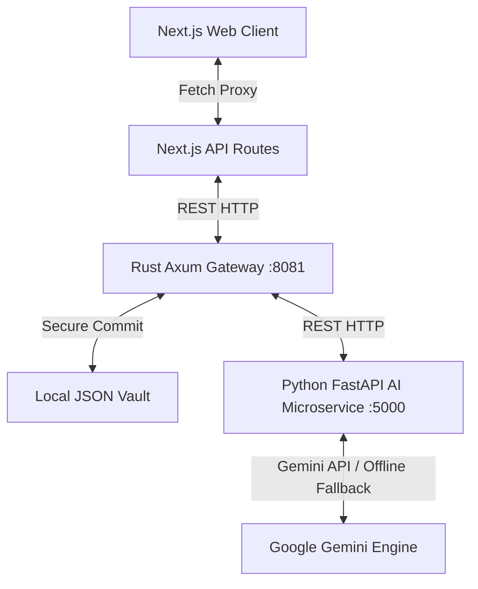

# BinaryScouts Digital Agency

[](https://nextjs.org/)
[](https://www.rust-lang.org/)
[](https://fastapi.tiangolo.com/)
[](https://reactjs.org/)
[](https://www.typescriptlang.org/)
[](https://tailwindcss.com/)
[](https://bun.sh/)
[](LICENSE)

> **Full-service digital marketing, CRM automation, and SEO conquest. We don't just follow trends. We rewrite the code.**

BinaryScouts is a premium, high-performance, full-stack digital agency platform. It combines a client-side Next.js web application, a secure **Rust Axum API Gateway**, and a **Python FastAPI AI microservice** integrating Google's Gemini models. The UI takes inspiration from classic terminal monitors, retro HUD displays, and cyberpunk color profiles.

---

## 🏗️ Full-Stack Architecture

BinaryScouts uses a distributed full-stack architecture to ensure security, high performance, and rapid AI operations:



1. **Frontend App Router**: Serves pages and proxies client requests to the backend gateway, isolating external API endpoints.
2. **Rust Gateway (`:8081`)**: Manages high-performance routing, applies permissive CORS, generates cryptographically randomized transaction codes, and logs client heist planner briefs securely in local JSON dossiers (`backend-rust/vault/*.json`).
3. **Python AI Service (`:5000`)**: Queries the Gemini API with structured system instructions to return cybersecurity strategy blueprints and chat dialogue responses. Supports offline sandboxed fallback rules.

---

## 🚀 Key Features

- **B.I.N.A.R.Y. AI Interactive Terminal**: A floating terminal interface mimicking retro command prompts. Chat with the AI directly or input local shell commands like `services`, `heist`, and `clear`.
- **Heist Budget Customizer & Planner**: A multi-step business customizer integrated with a custom hacking minigame. Completing the hack submits targets to the Rust gateway and returns custom AI-compiled operation blueprints.
- **Dynamic Theme & Font Drawer**: A sliding CRT HUD panel that changes the application's entire color palette, typography (Oswald, Rye, Orbitron, Cinzel), cursors, and scanline attributes in real-time.
- **Visual Design Aesthetics**: Curved clip-corner UI cards, scanline scrolling filters, custom HUD mouse pointers, and retro audio chirps for inputs, errors, and successes.

---

## 📁 Repository Restructured Map

```
binaryscouts/
├── app/                            # Next.js App Router (Routes & Proxies)
│   ├── api/
│   │   ├── chat/route.ts          # Proxies general chat to Rust backend
│   │   └── heist/route.ts         # Proxies heist submissions to Rust backend
│   ├── globals.css                # Global stylesheet and theme mappings
│   ├── layout.tsx                 # Root layout with HTML headers and SEO tags
│   └── page.tsx                   # HomePage route entry wrapper
├── components/                     # Categorized React Components
│   ├── hooks/                     # Context providers and hook structures
│   │   ├── AudioProvider.tsx      # HTML5 Web Audio context provider
│   │   └── ThemeProvider.tsx      # Dynamic CSS variable and font manager
│   ├── layout/                    # Global HUD layouts and utilities
│   │   ├── Navbar.tsx             # Main header menu bar
│   │   ├── Footer.tsx             # Page status and manifesto links
│   │   ├── LayoutWrapper.tsx      # Dynamic body overlay constructor
│   │   ├── CustomCursor.tsx       # Animated crosshair mouse follower
│   │   └── IntroLoader.tsx        # Automated CRT system boot visual loader
│   ├── pages/                     # Decoupled page layouts and states
│   │   ├── HomePage.tsx           # Homepage index view
│   │   ├── GamesPage.tsx          # Release catalogue view
│   │   └── PlannerPage.tsx        # Budget customizer and hacking minigame
│   └── ui/                        # Presentation widgets & visual grids
│       ├── Hero.tsx               # Cinematic header section
│       ├── ServicesGrid.tsx       # Interactive weapons list
│       ├── InfoSection.tsx        # Business CRM and SEO automation highlights
│       ├── SettingsDrawer.tsx     # Color profile customization drawer
│       └── Terminal.tsx           # Floating cyberpunk console
├── backend-rust/                   # Rust Axum Gateway Source
│   ├── src/main.rs                # Gateway routing, vault logging, and Python proxies
│   ├── vault/                     # Local JSON logs database directory
│   └── Cargo.toml                 # Rust dependencies configuration
├── backend-python/                 # Python FastAPI Microservice Source
│   ├── app.py                     # API routing, Gemini prompt builders, and fallbacks
│   └── requirements.txt           # Python packages listing
└── package.json                    # Frontend node dependencies
```

---

## 🛠️ Step-by-Step Installation & Local Execution

Follow these instructions to spin up the BinaryScouts stack locally:

### 1. Clone the repository
```bash
git clone <repository-url>
cd binaryscouts
```

### 2. Configure Environment Variables
Create a `.env.local` file in the root directory:
```env
GEMINI_API_KEY=your_gemini_api_key_here
```

### 3. Launch python AI Microservice
```bash
cd backend-python
python -m venv .venv
.venv\Scripts\activate   # Windows (use source .venv/bin/activate on Mac/Linux)
pip install -r requirements.txt
python -m uvicorn app:app --port 5000
```
*The service will boot on `http://127.0.0.1:5000`.*

### 4. Launch Rust API Gateway
```bash
cd ../backend-rust
cargo run
```
*The gateway will compile and start listening on `http://127.0.0.1:8081`.*

### 5. Start Next.js Frontend
```bash
cd ../
bun install    # Or npm install
bun run dev    # Or npm run dev
```
*Open [http://localhost:3000](http://localhost:3000) to view the portal.*

---

## 🎨 Typography & Accents Palette

The application binds styling accents to CSS variables dynamic mappings:

| Accent | Accents Mapping | Target Fonts | Primary Usage |
| :--- | :--- | :--- | :--- |
| **SYSTEM MATRIX** | Green & Orange | Oswald / Roboto | Cyberpunk terminal defaults |
| **RED DEAD CONQUEST** | Crimson & Amber | Rye / Courier Prime | Vintage western look |
| **VICE RETRO GLOW** | Neon Pink & Cyan | Orbitron / Inter | Retro neon grid theme |
| **BULLY PREP CLASS** | Gold & Navy | Cinzel / Georgia | Academy style look |

---

## 🤝 Guidelines & Conduct

Please refer to the following policy documents for more information:
- [CODE_OF_CONDUCT.md](CODE_OF_CONDUCT.md): Code of Conduct standards.
- [SECURITY.md](SECURITY.md): Vulnerability reporting procedures.
- [CONTRIBUTING.md](CONTRIBUTING.md): Detailed workflow checklists.
- [LICENSE](LICENSE): Released under the MIT License.

<div align="center">
  <strong>Dominate The Matrix</strong>
  <br />
  <em>We don't just play the game. We rewrite the code.</em>
</div>
